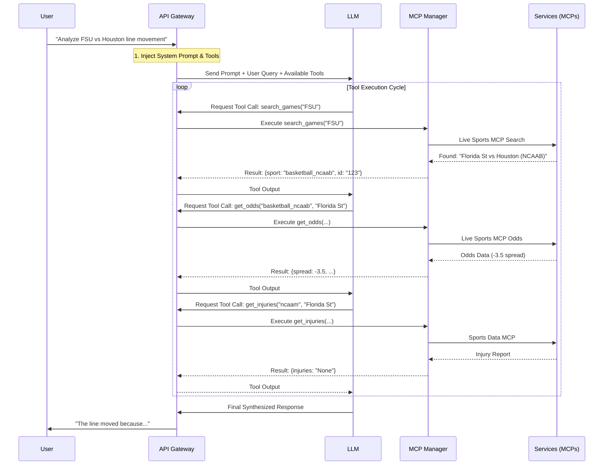

# LLM & MCP Architecture Guide

This document describes how the Large Language Model (LLM) interacts with the Model Context Protocol (MCP) servers to retrieve real-time sports data, analyze betting opportunities, and manage alerts.

## 🏗️ System Architecture

The system follows a microservices architecture where the **API Gateway** acts as the orchestrator between the frontend, the LLM (OpenAI or Ollama), and the specialized **MCP Servers**.

```mermaid
graph TD
    User[User / Frontend] -->|REST API / Chat| Gateway[API Gateway (FastAPI)]

    subgraph "LLM Layer"
        Gateway -->|Prompt + Context| LLM[LLM (GPT-4o / Local Granite)]
        LLM -->|Tool Calls| Gateway
    end

    subgraph "MCP Ecosystem"
        Gateway -->|MCP Protocol| Manager[MCP Manager]

        Manager -->|Tools| Live[Live Sports MCP]
        Manager -->|Tools| Data[Sports Data MCP]
        Manager -->|Tools| Monitor[Betting Monitor MCP]
        Manager -->|Tools| Weather[Weather MCP]
        Manager -->|Tools| Context[Betting Context MCP]
    end

    Live -->|Odds API| OddsProvider[The Odds API]
    Data -->|Stats/Injuries| ESPN[ESPN API]
    Weather -->|Forecasts| Meteo[Open-Meteo API]

    Monitor -->|Alerts| DB[(Alerts DB)]
```

### Key Components

1.  **API Gateway**: The central hub that receives user messages, manages sessions, and routes requests. It maintains the connection to the LLM and the MCP manager.
2.  **MCP Manager**: A specialized component that aggregates tools from all registered MCP servers and exposes them to the LLM as function calls.
3.  **MCP Servers**:
    *   **Live Sports**: Handles real-time odds, line movements, and identifying games (Odds API).
    *   **Sports Data**: Fetches team records, standings, and injury reports (ESPN).
    *   **Betting Monitor**: Tracks line history and generates alerts for steam moves or significant shifts.
    *   **Weather**: Provides stadium-specific weather forecasts.
    *   **Betting Context**: Contains strategic knowledge guides (teasers, bankroll management).

---

## 🔄 The Process: From Query to Analysis

When a user asks a question like *"Analyze the line movement for FSU vs Houston"*, the system executes a multi-step "ReAct" (Reasoning + Acting) loop.



### Step-by-Step Flow

1.  **Intent Recognition**: The LLM analyzes the user's request. It sees tools available like `get_odds`, `search_games`, `get_injuries`, etc.
2.  **Tool Selection**:
    *   If the sport is ambiguous (e.g., "FSU"), the LLM calls `search_games("FSU")` to identify the correct sport and game.
    *   Once the sport is known (e.g., `basketball_ncaab`), it calls `get_odds` to see the current lines.
    *   It then calls `detect_line_movements` to verify if the line has shifted.
    *   Finally, it calls `get_injuries` and `get_team_stats` to gather context on *why* the line might be moving.
3.  **Execution**: The API Gateway intercepts these tool calls, executes them via the relevant MCP server, and feeds the text result back to the LLM.
4.  **Synthesis**: The LLM receives all the raw data (odds, injury text, stats) and synthesizes it into a professional betting analysis using the instructions in its system prompt.

---

## 🛠️ Tool Usage Strategy

The system prompt explicitly guides the LLM on which tools to combine for specific scenarios:

| Scenario | Tool Chain |
| :--- | :--- |
| **"Analyze Line Movement"** | `search_games` → `get_odds` → `detect_line_movements` → `get_injuries` → `get_team_stats` → `get_game_weather` |
| **"Best Bets?"** | `get_weekend_slate` → `find_teaser_candidates` → `get_value_finder` |
| **"Player Props"** | `get_odds` (for Game ID) → `get_player_props` → `search_guides` (strategy) |
| **"General Strategy"** | `search_guides` or `read_guide` |

## 🧩 Adding New Capabilities

To add a new capability (e.g., "Historical Trends"):
1.  **Create MCP Tool**: Add a function `@mcp.tool()` in a server that fetches the data.
2.  **Update Prompt**: Add the new tool to the list in `api_gateway/main.py` so the LLM knows when to use it.
3.  **Restart**: Restart the `api_gateway` container to register the changes.
